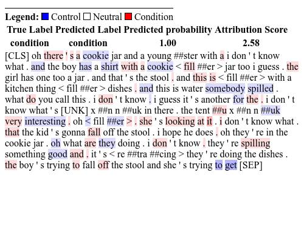
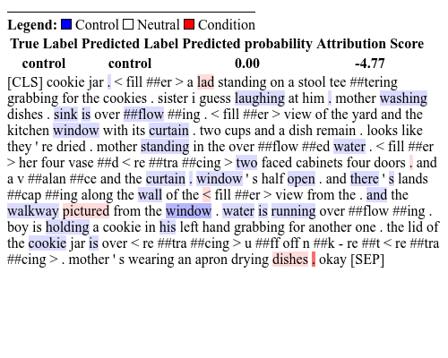

# __Statistical and Linguistic Insights for Model Explanation - SLIME__ 

__SLIME__ (_Statistical and Linguistic Insights for Model Explanation_) is an explainable AI pipeline designed to enhance the interpretability of Large Language Models (LLMs) by identifying and explaining the lexical features that drive model decisions. Originally developed to study speech patterns in neurological disorders such as Alzheimer’s Disease (AD), SLIME provides insights into the relationship between lexical components and LLM classifications, making it a valuable tool for clinical and linguistic research.

<p float="central">
  
    
</p>

## Installation

To install SLIME, we can use pip **command**:

```bash
pip install slime_nlp
```

## Content

The project is composed of three main [codes](https://github.com/marinatrs/slime_nlp/tree/main/slime_nlp):
- __dataset.py__ for pre-processing _.csv_ dataset;
- __model.py:__ the custom LLM for classification;
- __slime.py:__ for model explanability tools.

Check the tutorials in [docs](https://github.com/marinatrs/slime_nlp/tree/main/docs).


## References

The paper is currently under submission process.

#### About the authors
- [[ORCID] Marina Ribeiro](https://orcid.org/0000-0002-2516-3135)
- [[ORCID] Tibério Pereira](https://orcid.org/0000-0003-1856-6881)
