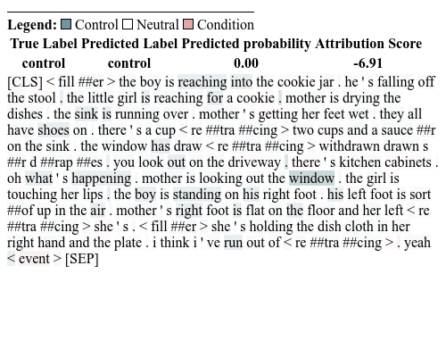

# __Statistical and Linguistic Insights for Model Explanation - SLIME__ 

Slime is a ...

<p float="central">
  
</p>

## Installation

To install SLIME, we can use pip [command](https://pypi.org/project/grav-waldo/):

```bash
pip install slime_nlp
```

## Content

The project is composed of three main [codes](https://github.com/marinatrs/slime_nlp/tree/main/slime_nlp):
- __dataset.py__ for pre-processing _csv_ dataset;
- __model.py:__ the custom LLM for classification;
- __slime.py:__ for model explanability.

Check the tutorials in [docs](https://github.com/marinatrs/slime_nlp/tree/main/docs).

#### About the authors
- [[ORCID] Marina Ribeiro](https://orcid.org/0000-0002-2516-3135)
- [[ORCID] Tibério Pereira](https://orcid.org/0000-0003-1856-6881)